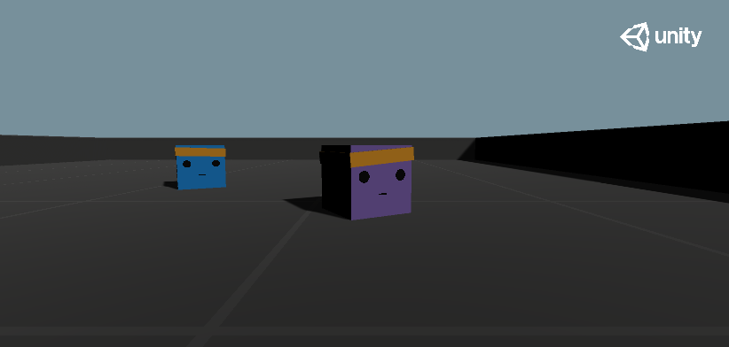

# CubeTrack



This project uses the game engine Unity and the Unity [ML-Agents](https://github.com/Unity-Technologies/ml-agents) Toolkit to provide a reinforcement learning environment for training an agent to actively track a moving target. The Unity scenes CubeTrack and VisualCubeTrack are set up to use the ML-Agents implementation of PPO (Proximal Policy Optimization), a 5-choice discrete action space, vector and visual observations respectively, and the reward function described in this paper by [Luo](http://proceedings.mlr.press/v80/luo18a/luo18a.pdf) et al. (2018)

Blog post on Medium: https://knrichardson.medium.com/cubetrack-deep-rl-for-active-tracking-with-unity-ml-agents-6b92d58acb5d

The game objects used in the Unity scenes have been sourced from the ML-Agents example environment [PushBlock](https://github.com/Unity-Technologies/ml-agents/tree/master/Project/Assets/ML-Agents/Examples)

## Installation 

1. Download and install Unity (2018.4 or later) - installation through Unity Hub is recommended
2. Install Python (3.6.1 or higher) - using a Python virtual environment with something like pipenv or conda is recommended
3. Follow the instructions [here](https://github.com/Unity-Technologies/ml-agents/blob/master/docs/Installation.md) for installing the various ML-Agents packages (note that cloning the ML-Agents repository is optional) 
4. Clone this repository (if you have cloned the ML-Agents repository, the CubeTrack repository should live within the ML-Agents repository at root level)

Version information used in development:
  ml-agents: 0.18.0,
  ml-agents-envs: 0.18.0,
  Communicator API: 1.0.0,
  TensorFlow: 1.14.0,
  Unity: 2019.4.4f1,
  Python: 3.6.9

## Watch a trained agent

The CubeTrack GitHub repository includes the saved models and tensorboard files for five training runs within the results folder. The runs 'visual_grayscale_simple' and 'visual_colour_simple' are unsuccessful training runs that were cut short at around 2M steps. The run 'visual_grayscale_simple(old)' was ran on an older, simpler version of the CubeTrack environment (explained in Medium blog). The runs 'vector_simple' and 'visual_colour_resnet' are the successful training runs (5M steps) using vector and visual observations respectively. The training statistics for all of these runs can be viewed in Tensorboard with the terminal command

```
tensorboard --logdir results
```

To watch an agent in action ..
1. Open the CubeTrack project in Unity
2. Open either the CubeTrack or VisualCubeTrack scene by selecting the Scenes folder in the Project window and double clicking on a scene
3. Open the TF-Models folder in the Project window
4. Select the Agent or VisualAgent game object in the Hierarchy Window
5. Drag the CubeTrack.nn or VisualCubeTrack.nn file into the Model field under Behaviour Parameters in the Inspector Window
6. Press play

## Train your own agent

To train an agent, first make sure to change the Model field of every agent game object to **None**. Edit the training configuration by changing the hyperparameters in the appropriate yaml file, located in the config folder. From the root of the CubeTrack directory, open a terminal, activate your python virtual environment, and issue the command

```
mlagents-learn ./config/ppo/CubeTrack.yaml --run-id=runName
```

with a run name of your choice and with any additional options tagged on the end (use -h to explore the full usage of the mlagents-learn command). If training with visual observations, the filepath should be to VisualCubeTrack.yaml. Note you can also issue this command from the root of the ML-Agents repository so long as the appropriate yaml file is in the ML-Agents config folder alongside the yaml files for the example environments. Models and training statistics will go into the ML-Agents results folder in this instance. 

## Credits

* Juliani, A., Berges, V., Teng, E., Cohen, A., Harper, J., Elion, C., Goy, C., Gao, Y., Henry, H., Mattar, M., Lange, D. (2020). Unity: A General Platform for Intelligent Agents. arXiv preprint arXiv:1809.02627. https://github.com/Unity-Technologies/ml-agents
* Luo, W., Sun, P., Zhong, F., Liu, W., Zhang, T., & Wang, Y. (2018, July). End-to-end active object tracking via reinforcement learning. In International Conference on Machine Learning (pp. 3286–3295).

